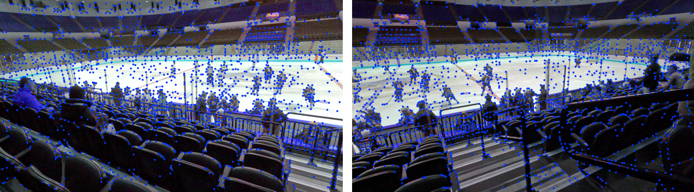
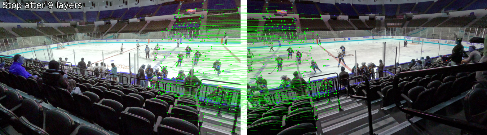

Fast panorama stitching of two images.

Used for stitching two high-resolution (5K) GoPro videos into a single (roughly) 8500x3300 panorama video.
This repo simply delivers the high-performance stitching code.  Running through each frame of videos and stitching them is not currently part of this repo, since this repo is focused mainly on the stitching code wrt a single frame.

```
Speed on RTX4090 with 6 laplacian levels:     340 fps
Speed on Jetson with 6 levels:                  8 fps
Speed on Jetson with 0 levels:                 20 fps
```

For the Jetson, scaling down the pano config to around 6000 pixels width brings it up to 50 fps

Procedure:

Install Hugin and Enblend:
```
sudo apt-get install hugin hugin-tools enblend
```

Maybe install bazelisk
```
./scripts/install_bazelisk.sh
```

Build the code
```
bazelisk build //...
```

Put the left and right videos into some directory
Run the configuration to configure the stitching. 
It will write some project and mapping files (along with keypoint matching illustrations to) the directory where the videos reside.
```
python scripts/create_control_points.py <path to left video> <path to right video>
```
 
Run the stitching test
```
./bazel-bin/tests/test_cuda_blend --show --perf --output=myframe.png --directory=<directory where the video was/project files were saved>
```

Left frame:


Right frame:


Key points (SuperPoint)


Matches (LightGlue)


Stitched Panorama (CUDA Kernels, hard seam or laplacian blending + color correction)


## Working Examples

The commands below are tested on the provided assets using the Python from the `ubuntu` conda env and the built Bazel binaries.

### 1) Two-Image Stitch (assets/left.png + assets/right.png)

- Generate control points and Hugin mappings (writes into `assets/`):
```
python3 scripts/create_control_points.py --left assets/left.png --right assets/right.png --max-control-points 200
```
- Run the CUDA stitcher (0 levels = hard seam, fastest):
```
./bazel-bin/tests/test_cuda_blend --levels=0 --directory=assets --output=assets/pano_left_right.png
```
- View the result:
```
viewnior assets/pano_left_right.png &
```
- Result preview (clickable path): `assets/pano_left_right.png`

Example outputs and diagnostics written to `assets/`:
- Matches: `assets/matches.png`
- Keypoints: `assets/keypoints.png`
- Seam file (from enblend): `assets/seam_file.png`
- Mappings: `assets/mapping_000{0,1}_[xy].tif`

### 2) Three-Image Stitch (assets/weir_1,2,3 → assets/three/)

Prepare a small working folder and convert the inputs to the naming the demos expect (`image0.png`, `image1.png`, `image2.png`):
```
mkdir -p assets/three
ffmpeg -y -loglevel error -i assets/weir_1.jpg assets/three/image0.png
ffmpeg -y -loglevel error -i assets/weir_2.jpg assets/three/image1.png
ffmpeg -y -loglevel error -i assets/weir_3.jpg assets/three/image2.png
```

Create the Hugin project, find control points, optimize, and export remap files (`mapping_000i_[xy].tif`) and warped layers (`mapping_000i.tif`):
```
cd assets/three
pto_gen -p 0 -o three.pto -f 65 image0.png image1.png image2.png
cpfind --multirow -o three_cp.pto three.pto
autooptimiser -a -m -l -s -o three_opt.pto three_cp.pto
nona -m TIFF_m -z NONE --bigtiff -c -o mapping_ three_opt.pto
```

Generate a simple 3-class paletted seam mask (required by the 3-image path). This creates vertical stripes 0/1/2 across the canvas; it is sufficient for testing and can be replaced by a more advanced seam:
```
python3 - << 'PY'
import cv2, os, numpy as np
from PIL import Image

def tiff_pos(path):
    import tifffile
    def to_float(v):
        try: return float(v)
        except Exception:
            return v[0]/v[1] if isinstance(v,(tuple,list)) and len(v)==2 else 0.0
    with tifffile.TiffFile(path) as tf:
        t=tf.pages[0].tags
        xres=to_float(t.get('XResolution',1.0).value) if 'XResolution' in t else 1.0
        yres=to_float(t.get('YResolution',1.0).value) if 'YResolution' in t else 1.0
        xpos=to_float(t.get('XPosition',0.0).value) if 'XPosition' in t else 0.0
        ypos=to_float(t.get('YPosition',0.0).value) if 'YPosition' in t else 0.0
    return xpos*xres, ypos*yres

ps=[]; sizes=[]
for i in range(3):
    ps.append(tiff_pos(f'mapping_{i:04d}.tif'))
    x=cv2.imread(f'mapping_{i:04d}_x.tif', cv2.IMREAD_ANYDEPTH)
    y=cv2.imread(f'mapping_{i:04d}_y.tif', cv2.IMREAD_ANYDEPTH)
    sizes.append((y.shape[0], x.shape[1]))
W=int(max(ps[i][0]+sizes[i][1] for i in range(3)))
H=int(max(ps[i][1]+sizes[i][0] for i in range(3)))

seam=np.zeros((H,W), np.uint8)
seam[:, :W//3]=0
seam[:, W//3:2*W//3]=1
seam[:, 2*W//3:]=2
img=Image.fromarray(seam, mode='P')
img.putpalette([0,0,0, 0,255,0, 255,0,0] + [0,0,0]*253)
img.save('seam_file.png')
print('seam_file.png written', H, W)
PY
```

Stitch using the 3-image path (hard seam for speed) and view it:
```
cd -
./bazel-bin/tests/test_cuda_blend3 --levels=0 --directory=assets/three --output=assets/three/pano_three_3way.png
viewnior assets/three/pano_three_3way.png &
```

Alternatively, the generic N-image path works with the same folder (num-images=3):
```
./bazel-bin/tests/test_cuda_blend_n --levels=0 --num-images=3 --directory=assets/three --output=assets/three/pano_three_n.png
```

Input previews:
- `assets/three/image0.png`
- `assets/three/image1.png`
- `assets/three/image2.png`

Output previews:
- `assets/three/pano_three_3way.png`
- `assets/three/pano_three_n.png`

## N-Image Stitching (Arbitrary N)

You can stitch 2–8 images using the N-image path.

Build:
```
bazelisk build //tests:test_cuda_blend_n
```

Run (soft seam example with 4 inputs):
```
./bazel-bin/tests/test_cuda_blend_n \
  --num-images=4 --levels=6 \
  --directory=<data_dir> \
  --output=out.png --show
```

Run (hard seam, no pyramid):
```
./bazel-bin/tests/test_cuda_blend_n \
  --num-images=3 --levels=0 \
  --directory=<data_dir> \
  --output=out.png
```

Expected files under `<data_dir>` for N images (0..N-1):
- Input frames: `image0.png`, `image1.png`, ..., `image{N-1}.png`
- Remaps (CV_16U): `mapping_000i_x.tif`, `mapping_000i_y.tif` for each i
- Positions (TIFF tags): `mapping_000i.tif` (used to derive canvas placement)
- Seam mask (indexed 8-bit paletted): `seam_file.png` with classes `[0..N-1]` (one class per image)
